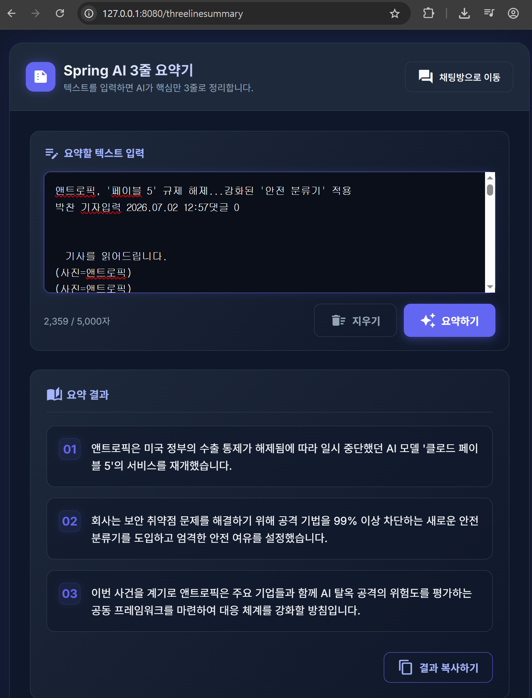
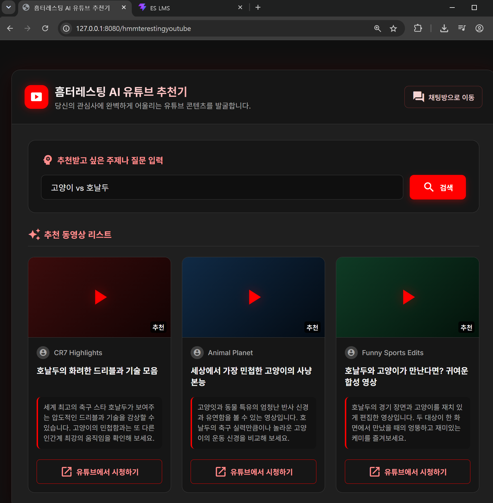

# Spring AI 기반 독립형 AI 서비스 프로젝트

이 프로젝트는 **Spring AI**와 **Gemini 모델**을 연동하여 개발된 웹 애플리케이션입니다. 메인 채팅 서비스 외에 독립적으로 운영되는 두 가지 유용한 AI 어시스턴트 기능인 **3줄 요약기**와 **유튜브 영상 추천기**가 포함되어 있습니다.

---

## 📌 주요 서비스 소개

### 1. 3줄 요약기 (`/threelinesummary`)
긴 텍스트(기사, 문서, 논문 등)를 입력하면 AI가 핵심 내용만 골라 **정확히 3줄의 명쾌한 한국어 문장**으로 요약해 주는 서비스입니다. 

- **주요 기능**:
  - **실시간 글자 수 카운팅**: 입력 중인 글자 수를 카운팅하여 UI에 실시간으로 표시합니다.
  - **스켈레톤 로딩**: AI가 분석하는 동안 미려하게 깜빡이는 뼈대(Skeleton) UI가 나타납니다.
  - **순차 애니메이션**: 완성된 3줄의 요약 결과 카드가 시간차(Staggered)를 두고 위로 떠 오르며 노출됩니다.
  - **클립보드 원클릭 복사**: 요약 결과를 복사한 후 은은하게 생성되는 토스트(Toast) 팝업 알림을 지원합니다.

---

### 2. 흠터레스팅 AI 유튜브 추천기 (`/hmmterestingyoutube`)
사용자가 관심이 있는 주제나 질문을 입력하면, AI가 내용과 가장 부합하는 **최적의 유튜브 영상 3개**를 선별하여 추천해 주는 서비스입니다.

- **주요 기능**:
  - **JSON 데이터 파싱**: AI가 비동기로 리턴한 정형화된 데이터(`제목`, `채널`, `추천사유`, `검색어`)를 안전하게 파싱하여 카드 형태로 출력합니다.
  - **스케톤 비디오 프레임**: 유튜브 로고를 중심으로 로딩 중임을 시각화하는 비디오 스켈레톤 카드를 지원합니다.
  - **유튜브 아웃링크 자동 연동**: 동영상 카드 클릭 시 최적의 검색 질의어(`searchQuery`)를 인코딩하여 실제 유튜브 검색 결과 창으로 즉시 넘어갈 수 있게 지원합니다.

---

## 🛠️ 실행 및 구동 가이드

> [!IMPORTANT]
> **Windows 한글 경로명(Gradle Worker Daemon) 빌드 오류 해결 방법**
> Windows의 사용자 계정명에 한글이 포함된 경우(`C:\Users\금정산2-PC15`), 터미널 상에서 `./gradlew compileJava` 실행 시 Gradle의 워커 프로세스가 클래스를 로드하지 못하는 인코딩 문제(`ClassNotFoundException`)가 발생할 수 있습니다.
> 
> **해결책**:
> - **Eclipse (STS)** 또는 **VS Code** 등의 IDE에 프로젝트를 가져온 뒤, IDE 자체 빌드/실행 시스템(Run / Run as Spring Boot App)을 이용해 실행해 주시면 오류 없이 즉시 정상 빌드 및 실행됩니다.

### 실행 방법
1. IDE에서 `Day01ChatClientApplication.java` 파일을 열고 실행합니다.
2. 서버 가동 완료 후 브라우저를 통해 아래 주소로 각각 접속하여 독립적으로 사용하실 수 있습니다.
   - **기본 채팅방**: `http://localhost:8080/chat`
   - **3줄 요약기**: `http://localhost:8080/threelinesummary`
   - **유튜브 추천**: `http://localhost:8080/hmmterestingyoutube`
